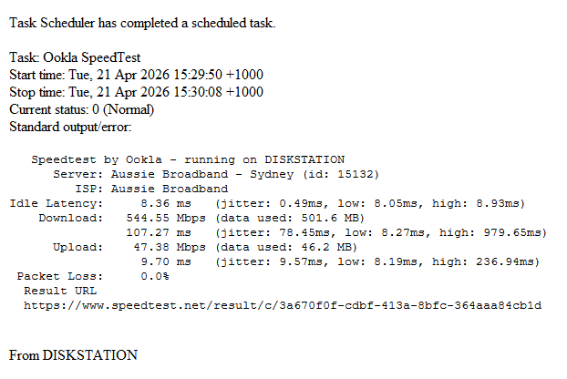
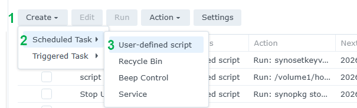
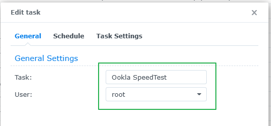
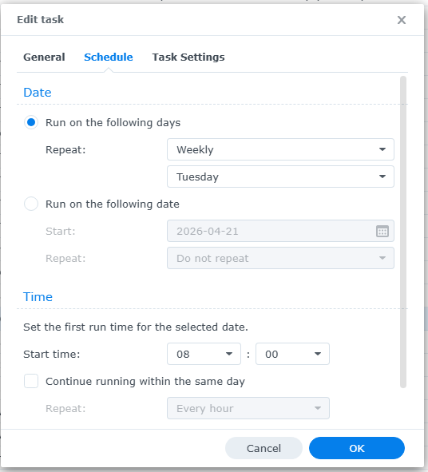
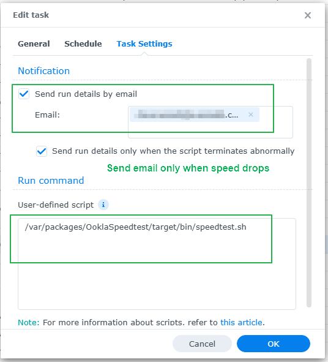

## How to schedule speed tests and get an email of the results

<p align="center">Sample email</p>
<p align="center"><kbd></kbd></p>

1. Go to **Control Panel** > **Task Scheduler** > click **Create** > and select **Scheduled Task**.
2. Select **User-defined script**.
3. Enter a task name like "Ookla Speedtest.
4. Select **root** as the user (The speedtest binary needs to run with elevated permissions).
5. Click **Schedule** and set the schedule you want.
6. Click **Task Settings**.
7. Tick **Send run details by email**.
    - Optionally tick **Send run details only if script terminates abnormally** to only send an email if the speed drops by 10% of the previous result or drops into a lower Ethernet speed range.
8. In the **Email** box type your email address.
9. In the box under **User-defined script** copy and paste the following. 
    ```
    /var/packages/OoklaSpeedtest/target/bin/speedtest.sh
    ```
10. Click **OK** to save the settings.

**Here's some screenshots showing what needs to be set:**

<p align="center">Step 1</p>
<p align="center"><kbd></kbd></p>

<p align="center">Step 2</p>
<p align="center"></p>

<p align="center">Step 3</p>
<p align="center"></p>

<p align="center">Step 4</p>
<p align="center"></p>
